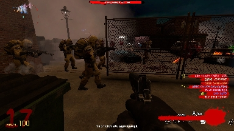
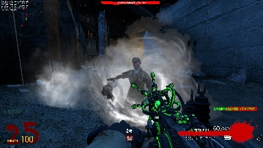

## 🛑 Development PAUSED for public use!

Due to nZombies Rezzurrection **stealing** my code and **not giving any credit**, I've decided to **keep changes exclusive to the [servers](https://nzcservers.com)** for the time being.

See [Server Usage](#server-usage) for details on how to join.

#  nZombies Chronicles
**nZC** (**nZombies Chronicles**) is a community-driven successor to [Zet0r's nZombies](https://github.com/Zet0rz/nzombies).

It recreates the **classic Call of Duty Zombies** experience in **Garry's Mod**, featuring community-made zombie maps, perks, weapons, and round-based gameplay.

* Holds high standards
* Stays true to classic gameplay
* Fully supports Singleplayer and Multiplayer
* Keeps download requirements as low as possible
* Improves the mode without completely changing it:
    * Bug Fixes
    * Performance Optimization
    * Multiplayer Compatibility
    * Security Patches
    * 
* Adds new content while preserving core gameplay:
    * Tools
    * Traps
    * Zombie and Boss variants
    * Spawners
    * Icons
    * Documentation

## Server Usage
nZombies Chronicles powers the official **nZC** servers, which first opened in 2020. It has ranked #1, receiving over 10,000 unique players!

##### [Website](https://nzcservers.com) | [Discord](https://discord.gg/Xmmvb55AjZ)

##### Join via the server browser:

Server List → **nZombies Chronicles** → nZC

##### Or connect via the IP:

`play.nzcservers.com:27018`

 

 

 

 

 

 

## Download
#### Missing Content

Some content is missing from this repo because of copyright concerns.

You can download them from the [Addon Collection](https://steamcommunity.com/sharedfiles/filedetails/?id=3378413470).

#### Steps
Follow these steps to ensure the gamemode and all associated assets (models, materials, etc.) mount correctly.

1.  **Download & Extract:** Download the repository ZIP and extract it to a temporary location.
2.  **Locate the Root:** Open the extracted folder. You should see several directories such as `models`, `materials`, `sound`, and `gamemodes` all in one place.
3.  **Move to Addons:** Move the folder containing those directories into your `garrysmod/addons/` folder. You can rename it `nzombies-chronicles`.
4.  **Verify the File Structure:** Your directory tree **must** look like this for the assets to load:
    * `garrysmod/addons/nzombies-chronicles/gamemodes/`
    * `garrysmod/addons/nzombies-chronicles/lua/`
    * `garrysmod/addons/nzombies-chronicles/models/`
    * `garrysmod/addons/nzombies-chronicles/materials/`
    * `garrysmod/addons/nzombies-chronicles/sound/`
    * `garrysmod/addons/nzombies-chronicles/particles/`
5. Restart your game
6. In the gamemodes selection on the bottom right, select **nZombies Chronicles**

⚠️ Conflict warning:
* Many addons **break the game**. Uninstall anything that gives errors. Stick to official and reputable addons.
